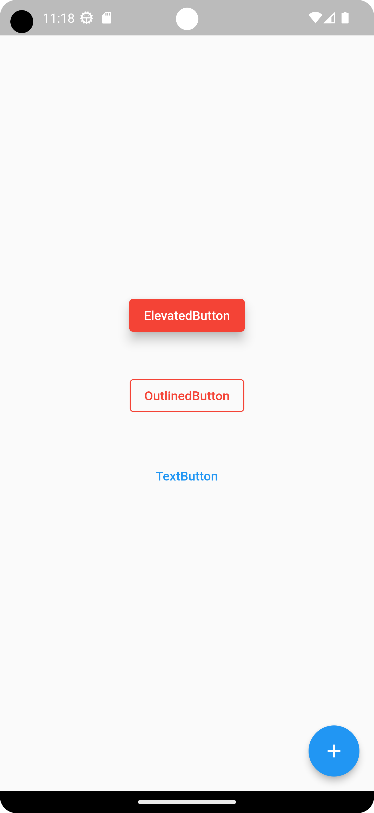

# Flutter Button Widgets

<p>Output</p>



```flutter
return MaterialApp(
      debugShowCheckedModeBanner: false,
      home: Scaffold(
        body: Column(
          mainAxisAlignment: MainAxisAlignment.center,
          children: [
            Center(
              child: ElevatedButton(
                  onPressed: () {},
                  style: ElevatedButton.styleFrom(
                      backgroundColor: Colors.red, elevation: 10),
                  child: const Text("ElevatedButton")),
            ),
            const SizedBox(
              height: 40,
            ),
            Center(
              child: OutlinedButton(
                onPressed: () {},
                style: OutlinedButton.styleFrom(
                  foregroundColor: Colors.red,
                  side: const BorderSide(color: Colors.red),
                ),
                child: const Text("OutlinedButton"),
              ),
            ),
            const SizedBox(
              height: 40,
            ),
            Center(
              child: TextButton(
                onPressed: () {},
                child: const Text("TextButton"),
              ),
            ),
          ],
        ),
        floatingActionButton: FloatingActionButton(
          splashColor: Colors.red,
          onPressed: () {},
          child: const Icon(Icons.add),
        ),
      ),
    );
```